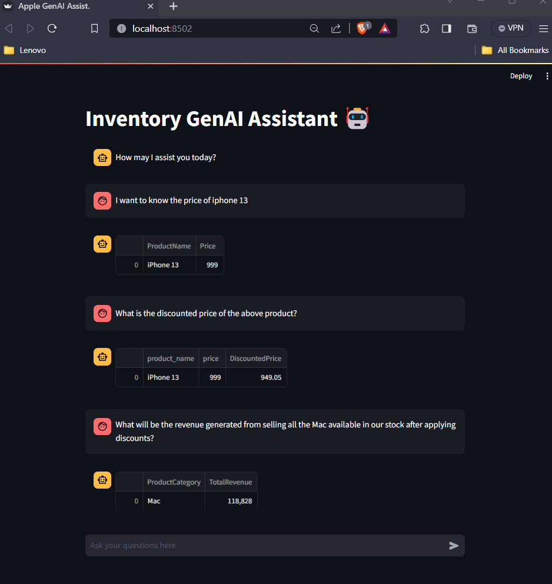

# Apple - Inventory Management System



This Inventory management system is developed to query a database via some naive human texts with the intention that a person without any Query language knowledge can also fetch the needed queries

For this, we have used Langchain which is using GooglePALM Large language model api to fetch the database through custom textual queries.

To imporve the performance of LLM model on our data, we have further used Few shot prompting technique, where we give some example along with our query prompt for the LLM to get more context out of the data and query.

In order to run this app you would need to clone the repo
```bash
git clone https://github.com/singh97kishan/Apple-SCM-LLM.git
```

> Please use your own GOOGLE_API_KEY and put it in .env file (Gonna delete this key) 

Create database and table using `sql_queries.sql` by pasting all the queries in your SQL workbench or equivalent alternative.

Run the `load_data_to_sql.ipynb` to push the csv data (apple_data.csv and discounts.csv) into created database and tables

Install all the needed dependencies
```bash
pip install -r requirements.text
```
Run the streamlit app
```bash
streamlit run app.py
```

## Sample Questions
1. what is the discounted price of mac pro
2. How many iphones are left in stock?
3. I want to know the price of iphone 13
4. What is the discounted price of the above product? (Follow up question)
5. What will be the revenue generated from selling all the Mac available in our stock after applying discounts?
5. What is the temperature today?

