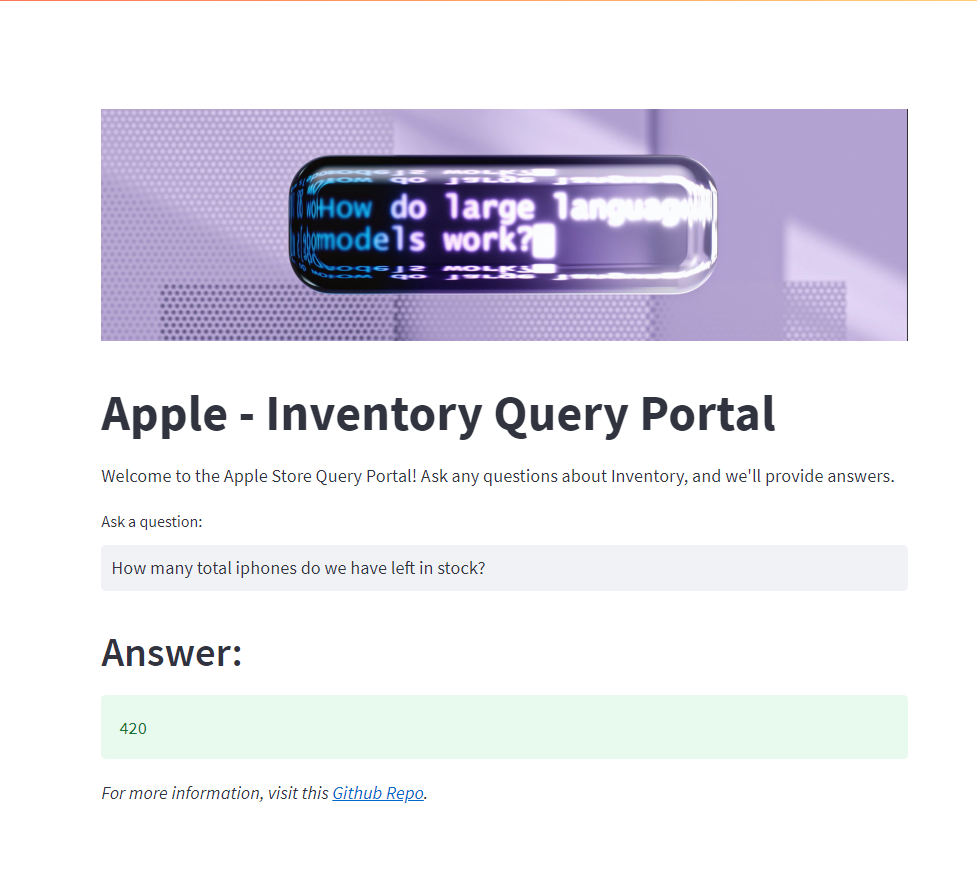

# Apple - Inventory Management System



In order to run this app you would need to clone the repo
```bash
git clone https://github.com/singh97kishan/Apple-SCM-LLM.git
```

> Please use your own GOOGLE_API_KEY and put it in .env file (Gonna delete this key) 

Create database and table using `sql_queries.sql` by pasting all the queries in your SQL workbench or equivalent alternative.

Run the `load_data_to_sql.ipynb` to push the csv data (apple_data.csv and discounts.csv) into created database and tables

Install all the needed dependencies
```bash
pip install -r requirements.text
```
Run the streamlit app
```bash
streamlit run app.py
```

